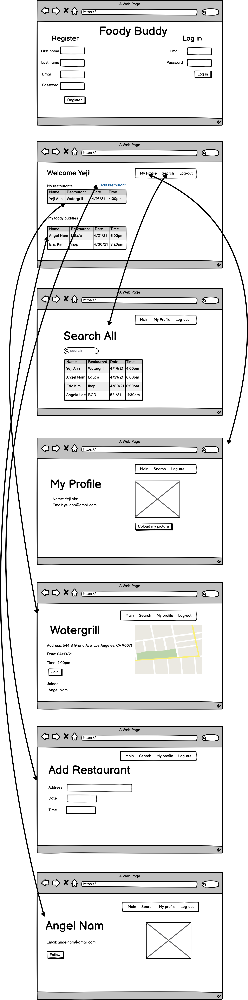

# Foody Buddy Website

## Description

I like to make the website that helps find other people who can and/or want to eat
together.

Through this website, it not only helps find other people to eat together, but can also
create opportunities to make new friend(s).

## Register & Login

## Main Page

## Implementation
<h3>Wireframe</h3>

## Features
<ul>
  <li> Login &amp; register</li>
  <li> My restaurants table and my buddies’ restaurant table</li>
  <li> Add restaurant</li>
  <li> Menu bar (Main, Search, My profile, Log-out)</li>
  <li> &quot;Join&quot; button to join my friend&#39;s restaurant selection on restaurant information
  page</li>
  <li> “Follow” button to follow other users</li>
  <li> Filter (for all website users)</li>
  <li> My profile page</li>
  <li> Restaurant information page</li>
</ul>
